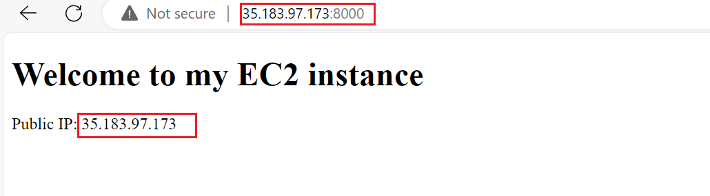
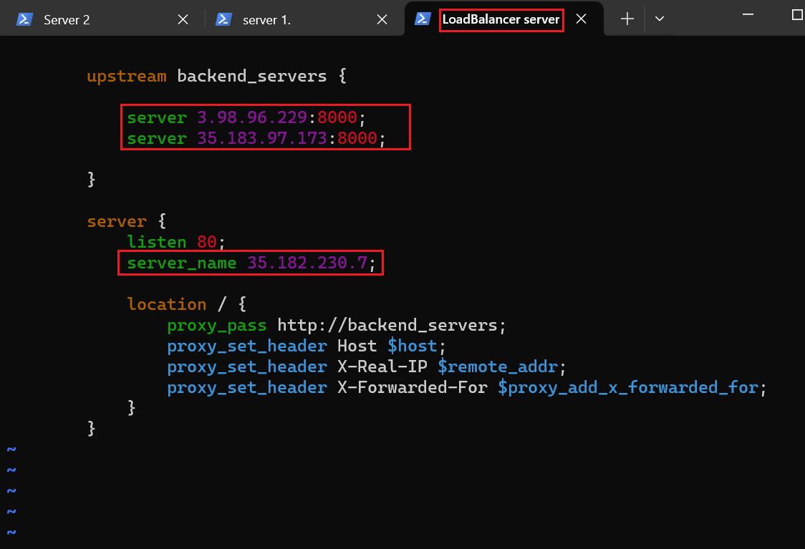
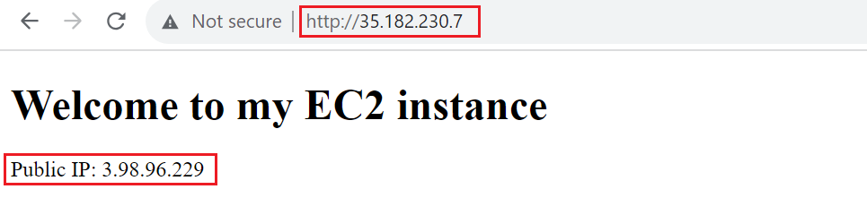

# Load-Balancing-solution-with-Nginx

Load Balances are servers that forward traffic to multiple
servers (e.g., EC2 instances) downstream. this means distributing work or tasks among several servers so that no one server gets overloaded with too much work. this helps to keep everything running smoothly and ensures that websites and apps work quickly and do not get too slow.


## Setting up a Basic Load Balancer
For this project we are going to provision two (2) EC2 instances  running on Ubuntu that will serve as the servers and the provision a third EC2 instance on the AWS console that will serve as the load balancer through Nginx 
On both server EC2 instances we will configure the security group by opening port `8000`  
we will now connect to the EC2 server instances via SSH as shown below  

next we will install Apache on the server instances by running `sudo apt update -y &&  sudo apt install apache2 -y` command as shown below 
 and then verify that apache is running using the `sudo systemctl status apache2` command as shown below  

 ### Configuring Apache to serve a page showing public IP:
 Here we will configure **Apache** webserver to serve content on port 8000 instead of its default which is port 80. We will do this by opening the file by running `sudo vi /etc/apache2/ports.conf` command and update the file by **ADDING** `Listen 8000` as a new listen directive and save the file for both servers as shown below    

 Next we will open the file on /etc/apache2/sites-available/000-default.conf and change port 80 on the virtualhost to 8000 for both servers by running `sudo vi /etc/apache2/sites-available/000-default.conf` command as shown below  
 we then save the file and close by running `esc :wq`
 We then restart apache to load the configuration using the command for both servers `sudo systemctl restart apache2` as shown below  

 Next we create a new **index.html** file that will contain code to display the public IP of the EC2 instance by running `sudo vi index.html` and inserting the html file below [before pasting the html file we update the public IP of our EC2 instance from AWS management console and replace the placeholder text for IP address in the html file] for both servers
```
{
        <!DOCTYPE html>
        <html>
        <head>
            <title>My EC2 Instance</title>
        </head>
        <body>
            <h1>Welcome to my EC2 instance</h1>
            <p>Public IP: YOUR_PUBLIC_IP</p>
        </body>
        </html>


}
```
as shown below  

We then change the ownership of the index.html file with `sudo chown www-data:www-data ./index.html` command as shown below  

Finanlly we will override the default html file of Apache web server by running `sudo cp -f ./index.html /var/www/html/index.html` command for both servers as shown below  
We will then restart the web servers by running `sudo systemctl restart apache2` command and open the public IP of our webservers on a browser as shown below  and 

### Configuring Nginx as a Load Balancer
On the third EC2 instance (Load Balancer) we will configure the security group by opening port `80`  
we will now connect to the LB EC2 server instance via SSH as shown below 

next we will install Nginx on the LB instance by running `sudo apt update -y && sudo apt install nginx -y` command as shown below 
 and then verify that Nginx is running using the `sudo systemctl status nginx` command as shown below 

 Next we will open the Nginx load balancer configuration file by running `sudo vi /etc/nginx/conf.d/loadbalancer.conf` then we paste the configuration file below to configure Nginx to act like a load balancer [before pasting the html file we update the public IP of our server EC2 instance from AWS management console and replace the placeholder text for IP address in the html file] for both Instance


        
        upstream backend_servers {

            # your are to replace the public IP and Port to that of your webservers
            server 127.0.0.1:8000; # public IP and port for webserser 1
            server 127.0.0.1:8000; # public IP and port for webserver 2

        }

        server {
            listen 80;
            server_name <your load balancer's public IP addres>; # provide your load balancers public IP address

            location / {
                proxy_pass http://backend_servers;
                proxy_set_header Host $host;
                proxy_set_header X-Real-IP $remote_addr;
                proxy_set_header X-Forwarded-For $proxy_add_x_forwarded_for;
            }
        }
    

as shown below 

**Upstream backend_servers** defines a group of backend servers. The **server** lines inside the **upstream** block list the adressess and ports of our backend server. **Proxy_pass** inside the **location** block sets up the the load balancing, passing the requests to the backend servers. the **proxy_set_header** lines pass necessary headers to the backend servers to correctly handle the requests.

We then save the configuration and test by running `sudo nginx -t` command as show shown below 

Finally we restart the Nginx to load the new conguguration by running `sudo systemctl restart nginx` 

In the end when we run the public IP address of the Nginx Load Balancer on our web browser, the web pages served by both server EC2 instances will be served as shown below  .
